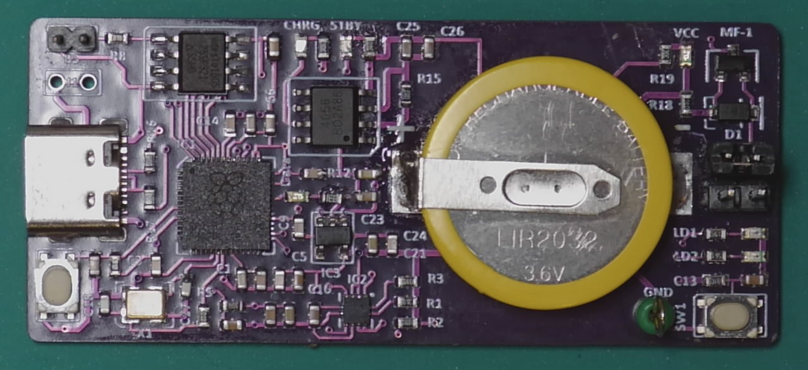
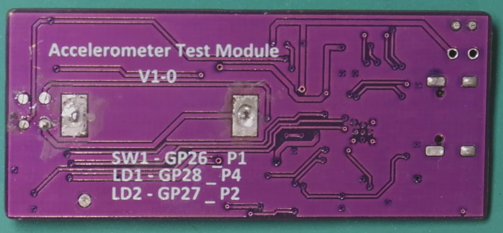
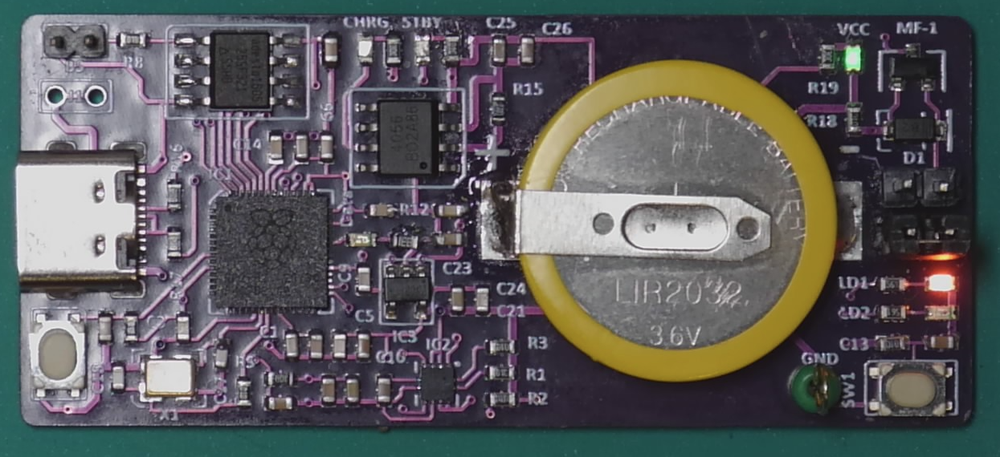
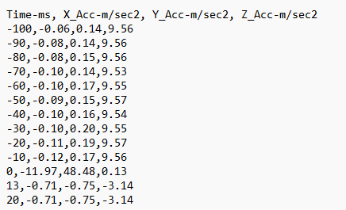
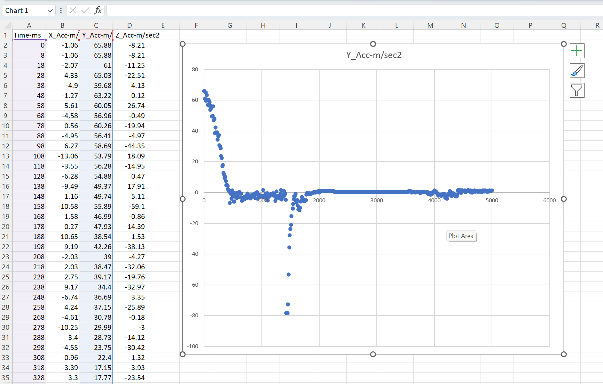

Kookaberry Accelerometer Module
===============================

The accelerometer module is a lightweight self-powered and rechargeable circuit board designed to be mounted on a moving vehicle to measure and record 
its acceleration in high resolution over short periods.

The module uses a subset of **Kookaberry** hardware and **Kookaberry** firmware.

`What is Acceleration? <docs/What-is-Acceleration.pdf>`_

Typical STEM applications include the `Reengineering Australia (REA) Formula 1 <https://rea.org.au/f1-in-schools/>`_ model race vehicles, ballistic rockets, bouncing balls, pendulums, 
free-fall devices etc.  In short, on anything that is propelled or moved where it is desirable to record its acceleration.

The mass (weight) of the circuit board has been minimised so that it does not overly reduce  acceleration.

The rechargeable battery is soldered onto the board and thereby does not constitute hazard to small children. 
Nevertheless, the module should not be within reach of or handled by small children.

Description
-----------

The Accelerometer Module is shown in the figures below.  Its key properties are:

•	Dimensions: 60mm L x 26mm W x 12mm H (inclusive of jumpers)
•	Weight: 10 grams (inclusive of battery)
•	Power: soldered-in rechargeable 3.6V battery recharged via USB-C connector. 
•	Power Switch: Jumpers next to battery - On – jumper in lower position; Off – jumper in upper
•	Computing: Raspberry Pi RP2040 microcomputer and LSM303 3-axis accelerometer
•	File Storage: 3.5 Mbytes accessible by plugging into a PC in the same way as a USB-C removable memory stick
•	Programmable User Interface: Pushbutton (SW1), Orange LED (LD1), Red LED (LD2)
•	Programming: **KookaSuite** (**KookaBlockly**, **MicroPython**) or **Thonny** (MicroPython) via USB-C.

.. _mfront:

    Accelerometer Module front

.. _mrear:

    Accelerometer Module rear

Software
--------

The Accelerometer Module comes pre-loaded with the **Kookaberry** firmware and **AustSTEM’s** AccelLog.py script which activates as soon as the power is turned on. 

AccelLog MicroPython Script
~~~~~~~~~~~~~~~~~~~~~~~~~~~

The AccelLog.py script measures and logs 3-axis accelerations using the built-in accelerometer.

The default parameters can be altered by editing the key parameters at the beginning of the script.  
Any MicroPython editor, particularly **KookaIDE** or **Thonny**, or even a simple text editor can be used.

The key parameters are:

   # Initial conditions

   DURATION = 5 # The logging duration in seconds

   PERIOD = 10 # The period between samples in milliseconds

   THRESHOLD = 20 # The threshold acceleration in m/sec^2 which initiates logging when armed

   PRESAMPLES = 10 # The number of samples retained prior to reaching the recording threshhold

When editing is completed, resave to the /app folder on the **Kookaberry Accelerometer Module**.

The script creates sequentially named files for each run in the form AccelLog-nnn.CSV wher nnn is the run number.

This script may be updated from time to time and will be available on this GitHub page.

Updates
!!!!!!!

To update the script, go to the code folder on this site, and download the following files to the accelerator module:

* `main.py <code/main.py>`_ - download to the **Kookaberry**'s root folder. This file starts the AccelLog.py script on startup or reset.
* `AccelLog.py <code/app/AccelLog.py>`_ - download to the **Kookaberry**'s app folder

Kookaberry Firmware
~~~~~~~~~~~~~~~~~~~

To obtain or update the **Kookaberry** firmware, go to https://github.com/kookaberry/kooka-releases.

Download the firmware for the RP2040 and follow the instructions to install it.
To update the firmware only requires downloading the `kooka_rp2040.bin <https://github.com/kookaberry/kooka-releases/blob/master/firmware/rp2040/kooka_rp2040.bin>`_ 
file to the **Kookaberry**'s root folder and then repowering the module.
A blue LED will then flash as the firmware is updated.

Operation
---------

The sequence of operation is:

1.	Mount the module securely on the vehicle whose acceleration is to be measured.  
    The module's mounting must be strong enough to prevent it moving around or off the vehicle when acceleration occurs.
2.	Place the vehicle on its launch position.
3.  Switch the power on by moving the jumper next to the battery on the pins closest to white pushbutton.  The Red LED should illuminate.
   

.. _mready:
.. figure:: images/module-front-ready.png
    :align: center
    :scale: 30%

    Accelerometer Module ready - red LED is on

4.	Push the white button to arm the program to record acceleration.  The Red LED will go off and the Orange LED will go on.

.. _marmed:

    Accelerometer Module armed - orange LED is on

5.	Launch the vehicle.  
    
    Recording of acceleration will commence as soon as the threshold acceleration, in any direction, is detected. 

    The Orange LED will blink during recording.

    After the programmed duration recording stops and both Red and Orange LEDs will be on.

6.	If further recordings are needed repeat the procedure from step 2.
7.	When finished, switch the power off by moving the jumper to the upper position.
8.	Connect the module to a PC via the USB-C connector and copy the CSV files to your PC for inspection and processing.	
    
    The files on the module should now be visible.

    Copy the AccelLog-nnn.csv files to your PC for processing by a spreadsheet program.  

    It is not recommended that you open them directly on the module as it doesn’t have much space and your work could be lost.

9.	Though there is ample space for more CSV files, it is good practice to delete the AccelLog CSV files occasionally to conserve file space.
10.	Leave the module plugged into the PC (when on) or a USB recharger for an hour or two so that its battery recharges.
11. Please eject the **Kookaberry** USB drive using the PC's operating system before unplugging the **Kookaberry** from the USB connector 
    to avoid damaging the files stored on the **Kookaberry**'s file storage system.

Data Analysis
-------------

The module will have stored a file called AccelLog-nnn.csv where nnn is an ascending integer corresponding to the recording run (ie. 001, 002, 003 etc).
Data recorded is in a format easily interpreted by a spreadsheet program and includes:

•	Milliseconds since beginning of recording run
•	X acceleration in m/sec^2
•	Y acceleration
•	Z acceleration

The typical content of the CSV file is shown below:

.. csvfile:

    Typical contents of the AccelLog-nnn.csv file

Open the file with a spreadsheet program such as Microsoft Excel or Google Sheets.

Select the data items you wish to graph, typically the ``Time-ms`` column on the x-axis, and the ``Y_Acc-m/sec2`` column on the y-axis 
and then insert a scatter plot from among the **Recommended Charts**.

.. csvfile:

    Y acceleration vs time scatter graph

Copyright
---------

**Kookaberry** and **Kooka** are trademarks of Kookaberry Pty Ltd, Australia.

The **Kooka Firmware** and **KookaSuite** were created by Damien George (George Electronics Pty Ltd – MicroPython) 
in collaboration with Kookaberry Pty Ltd and the `AustSTEM Foundation Ltd <https://auststem.com.au>`_.