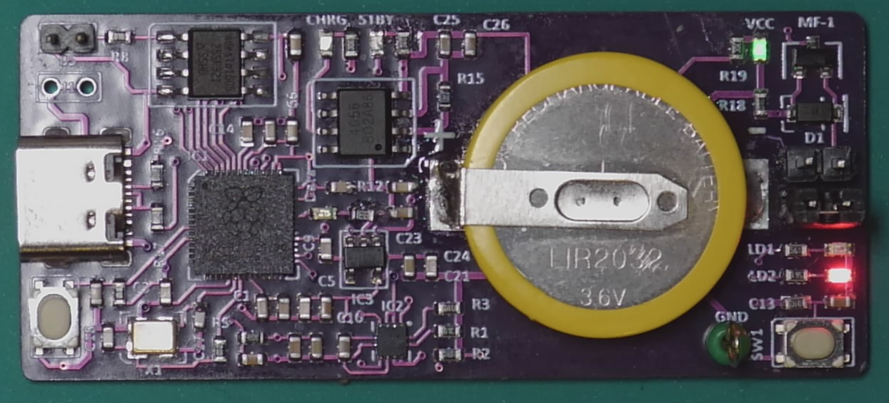

Kookaberry Accelerometer Module
======================================

The accelerometer module is a lightweight circuit board, using a subset of **Kookaberry** hardware and **Kookaberry** firmware, 
and is intended to be mounted on a moving vehicle to measure and record its acceleration in high resolution over short periods.

Typical STEM applications include the Reengineering Australia (REA) Formula 1 model race vehicles, ballistic rockets, bouncing balls, pendulums, 
free-fall devices etc.  

In short, on anything that is propelled or moved where it is desirable to record its acceleration.

The mass (weight) of the circuit board has been minimised so that it does not overly reduce  acceleration.

Description
-----------

The Accelerometer Module is shown in the figures below.  Its key properties are:

•	Dimensions: 60mm L x 26mm W x 12mm H (inclusive of jumpers)
•	Weight: 10 grams (inclusive of battery)
•	Power: soldered-in rechargeable 3.6V battery recharged via USB-C connector
•	Power Switch: Jumpers next to battery - On – jumper in lower position; Off – jumper in upper
•	Computing: Raspberry Pi RP2040 microcomputer and LSM303 3-axis accelerometer
•	File Storage: 3.5 Mbytes presented as a USB-C removable memory stick
•	Programmable User Interface: Pushbutton (SW1), Orange LED (LD1), Red LED (LD2)
•	Programming: **KookaSuite** (**KookaBlockly**, **MicroPython**) or **Thonny** (MicroPython) via USB-C.

.. _mfront:
.. figure:: images/module-front.png
    :align: center
    :scale: 30%

    Accelerometer Module front

.. _mrear:
.. figure:: images/module-rear.png
    :align: center
    :scale: 30%

    Accelerometer Module rear

Operation
---------

The Accelerometer Module comes pre-loaded with AustSTEM’s AccelLog.py script which activates as soon as the power is turned on.  

The sequence of operation is:

1.	Mount the module securely on the vehicle whose acceleration is to be measured.
2.	If necessary, connect to **KookaIDE** or **Thonny** to edit the key recording parameters in the script.

   # Initial conditions

   DURATION = 5 # The logging duration in seconds

   PERIOD = 10 # The period between samples in milliseconds

   THRESHOLD = 20 # The threshold acceleration in m/sec^2 which initiates logging when armed

   PRESAMPLES = 10 # The number of samples retained prior to reaching the recording threshhold

When edited, resave to the /app folder on the module.

3.  Place the vehicle on its launch position.
4.  Switch the power on by moving the jumper next to the battery on the pins closest to white pushbutton.  The Red LED should illuminate.
   

.. _mready:

    Accelerometer Module ready - red LED is on

5.	Push the white button to arm the program to record acceleration.  The Red LED will go off and the Orange LED will go on.

.. _marmed:
.. figure:: images/module-front-armed.png
    :align: center
    :scale: 30%

    Accelerometer Module armed - orange LED is on

6.	Launch the vehicle.  
    
    Recording of acceleration will commence as soon as the threshold acceleration, in any direction, is detected. 

    The Orange LED will blink during recording.

    After the programmed duration recording stops and both Red and Orange LEDs will be on.

7.	If desired, rearm the module by pressing the white button and relaunch the vehicle.
8.	When finished, switch the power off by moving the jumper to the upper position.
9.	Connect the module to a PC via the USB-C connector and copy the desired files to your PC for inspection and processing.	
    
    The files on the module should now be visible.

    Copy the AccelLog-nnn.csv files to your PC for processing by a spreadsheet program.  
    
    It is not recommended that you open them directly on the module as it doesn’t have much space and your work could be lost.

10.	Though there is ample space for more CSV files, it is good practice to delete the AccelLog CSV files occasionally to conserve file space.
11.	Leave the module plugged into the PC (when on) or a USB recharger for an hour or two so that its battery recharges.

Data Analysis
-------------

The module will have stored a file called AccelLog-nnn.csv where nnn is an ascending integer corresponding to the recording run (ie. 001, 002, 003 etc).
Data recorded is in a format easily interpreted by a spreadsheet program and includedes:

•	Milliseconds since beginning of recording run
•	X acceleration in m/sec^2
•	Y acceleration
•	Z acceleration
